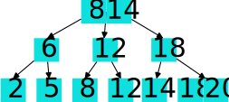

# Introduction
[達人に学ぶDB設計 徹底指南書](https://www.amazon.co.jp/dp/B00EE1XPAI)を読んだのでそれをまとめる.

帯に"初級者で終わりたくないあなたへ"と書いてあるが, 別にそこまでのこだわりは無いが, 一応読んでみる.

また, [スッキリわかるSQL入門](https://book.impress.co.jp/books/1123101107)のpart9以降の内容も含めている.

先に感想を述べるが, 
この本(達人本)は実務上のDB設計をするにあったって目を通しておくべき本である.
具体的なことを除いて論理設計に焦点が当てられているため, ある程度DBを触ったことがある人には有益である.
バッドノウハウに対してはDB設計の心構えに準ずる対応策が示されている.
主張のポイントが明確であり, それに至るまでの説明も筋道が立っている.
ただし, 一つの章に様々な主張が散逸しており, まとまりが無いと感じることがある.
そのため, 索引性は低い (DBの本なのに).
最近, この第二版が出たので, そちらを読むのが良いかもしれない.

---

DBというかシステムを作るということは, 
1. 要件定義
1. 設計
1. 開発
1. テスト

の流れで進められることが多い.
そしてデータはUIやビジネスロジックと比較して不変性が高い.
そのため, DB設計はシステムの"設計"の最初に行うべきである(というのが著者の主張).

DB設計の段階として3つのスキーマがある.

|スキーマ|設計内容|
|---|---|
| 外部スキーマ | ユーザーが見るDBの構造 |
| 概念スキーマ | DBの全体像 |
| 内部スキーマ | DBの物理的な構造 |

得に概念スキーマは重要で, これ他のスキーマに影響を与えるが, 他のスキーマから影響を受けない(ようにするのがベストプラクティス).

例えば, 概念スキーマは物理的なDBの性質に影響を受けないが, 概念スキーマによってDBの物理的性質を決めることができる. ということである.

以降ではシステム設計の中のDB設計について述べる.
## Contents
## 概念スキーマと物理スキーマ
概念スキーマでは, 主に論理設計を行う.
論理設計は, データベースの構造を決める設計である.
ここでは, 概念設計で明確になった情報について, RDBを使う前提でテーブルを設計する.
主にテーブルとその列を考える.

<div>
    <style>
        table {
            border-collapse: collapse;
            width: 100%;
        }
        th, td {
            border: 1px solid black;
            padding: 8px;
            text-align: left;
        }
        th {
            background-color: #f2f2f2;
        }
    </style>
    <table>
        <tbody sytle="white-space: nowrap;">
            <tr>
                <td rowspan=5>論理設計</td>
            </tr>
            <tr>
                <td>エンティティの抽出</td>
                <td> 現実->テーブル</td>
            </tr>
            <tr>
                <td>エンティティの定義</td>
                <td> テーブル->属性 </td>
            </tr>
            <tr>
                <td>正規化</td>
                <td>フォーマット化</td>
            </tr>
            <tr>
                <td>ER図</td>
                <td>作業用の足場の作成</td>
            </tr>
        </tbody>
    </table>
</div>

また, 物理スキーマでは, 主に物理設計を行う.
物理設計は, データベースの物理的な仕様を決める設計である.

<div>
    <style>
        table {
            border-collapse: collapse;
            width: 100%;
        }
        th, td {
            border: 1px solid black;
            padding: 8px;
            text-align: left;
        }
        th {
            background-color: #f2f2f2;
        }
    </style>
    <table>
        <tbody sytle="white-space: nowrap;">
            <tr>
                <td rowspan=6>物理設計</td>
            </tr>
            <tr>
                <td>テーブル定義</td>
                <td>ER図->DBMSのテーブル</td>
            </tr>
            <tr>
                <td>インデックス定義</td>
                <td>インデックスの作成</td>
            </tr>
            <tr>
                <td>サイジング</td>
                <td>ストレージサイズ・パフォーマンス</td>
            </tr>
            <tr>
                <td>冗長構成の決定</td>
                <td>RAIDの構成</td>
            </tr>
            <tr>
                <td>ファイルの物理配置</td>
                <td>data, index,..をどのHDDに入れるか</td>
            </tr>
        </tbody>
    </table>
</div>

また, バックアップとリカバリについても考慮する必要がある.
### バックアップ
バックアップには以下の3つがある.

- フルバックアップ: すべてのデータを保存する.
- 差分バックアップ: 起点から変更差分を保存する.
- 増分バックアップ: 変更差分から変更差分を保存する.

差分バックアップと増分バックアップの違いは非常に厄介で, ものによっては混同されていることもある.
例えば, 月曜から日曜までを考える場合, 月曜にフルバックアップを取り, 日曜に障害が発生するとする. 月曜のフルバックアップを月Fとすると,
差分バックアップは6つの領域に対して  
- 月F,
- 火 - 月F, 
- 水 - 月F,
- 木 - 月F,
- 金 - 月F,
- 土 - 月F,
を保存する.

一方, 増分バックアップは6つの領域に対して  
- 月F,
- 火 - 月F,
- 水 - 火,
- 木 - 水,
- 金 - 木,
- 土 - 金,
を保存する.

増分バックアップは差分バックアップよりもバックアップの容量が小さくなるというメリットがある.
しかし, その分だけリカバリの手順が煩雑になる.
ここのトレードオフは非常に重要で, 実際にデータが破損した場合は大抵心理的に余裕が無いため, なるべく簡単なリカバリ手順を取りたいはずである.
(そのため, 著者は差分バックアップを推奨している?)

また, もちろんフルバックアップを取れればよいが, フルバックアップを取る場合には時間がかかり, さらに対象のシステムを孤立化させないと整合性が保たれない可能性があるため, DBへのアクセスを停止する必要がある. そのため, 無闇矢鱈にフルバックアップを取るの現実的ではない.
また, ストレージやネットワークの容量, CPU使用率も考慮する必要がある.

増分バックアップは前の日の差分をとり, 差分バックアップはだんだんと差分が大きくなるので, それぞれを反対に覚えてしまうケースが多い.

### リカバリ
バックアップを取った場合, バックアップ時点に戻ることができる.
この作業を**リストア**という.
ただし, バックアップではバックアップ時点から障害発生直前の状態に戻ることはできない.
このような場合, バックアップに取っておいたトランザクションのログを追って実行することで, 障害発生直前の状態に戻すことができる. この作業を**リカバリ**という.

さらに, トランザクションログはDBMS内部にも保存されていることが多い.
このトランザクションログを使用してリカバリを行うことを**リカバリ(ロールフォワード)**という.

## 設計と正規化
先にも述べたが, DB設計には
- 概念設計
- 論理設計
- 物理設計
がある.

### 概念設計
概念設計では, エンティティを抽出し, その属性と関係を定義する.
しかし, 徒手空拳でテーブルを作成するのは非常に難しい.
そのため, エンティティを導き出すヒントを与える.

#### エンティティを導き出すヒント

- **候補となる用語を洗い出す**  
要件から"名詞"を抽出する.  
要件が実現されてる状況を想像して, "人", "物", "事実", "行為"などの用語を抽出する.
- **不要な用語を捨てる**  
具体的な用語を一般的な用語に置き換え, 算出可能なものは除外する.
- **関連がありそうなものを結びつける**  
同じ用語に関連があるものを結びつける.
- **エンティティ名と属性名に分ける**  
"\~をした\~"や"\~の\~"といった表現が成り立つ場合, 前の"\~"がエンティティ名, 後の"\~"が属性名となる.


ここで, エンティティをまとめ, ER図を書き出す.
ここで, 多対多の関係は中間にそれを1対多, 多対1に分解する.

例えば, ユーザーがツイートをリツイートしたりブックマークしたりする場合,


のようになる.
この場合, usersとretweetsは多対多の関係になっているが, この場合, retweetsテーブル自体がretweetを意味する中間テーブルになっている.  
(userは多数のretweetしたtweetを持つのでuserとtweetがretweetを介して多対多という方がわかりやすいかもしれない.)

### 論理設計

論理設計の目的はエンティティをテーブルに落とし込むことである.

以降では, 論理設計で注意すべきことについて羅列する.
1. テーブルはエンティティを表す.
よって, テーブルの設計は複数形で表せることが多い.
1. 主キーは存在するべきである.
よって, 重複するタプルは存在しない.
1. 参照関係には親子関係が存在する(継承のように).
よって, (参照先)親は(参照元)子の存在に先立ち, (参照先)親が存在しないと(参照元)子は存在しない.
1. 外部キーが設定されている場合, (参照元)子から先に削除する.
1. 可能な限りNOT NULL制約をつける.

上で挙げたもののうち, 主キーの存在に気をつけるべきである.
主キーは

- 一意性
- NULLでない
- 不変性

をもつことに注意する.


## 正規化
正規化は論理設計における最も中心的な作業である.
なぜ、正規化が必要であるのかというと内容に重複が生じる(更新や削除の対象が多くなる)からである.
これにより整合性が崩れる可能性がある.
**一つの事実は一箇所にまとめておくべきなのである.**

正規化の段階はおおよそ3つある.
1. 第一正規形: すべての属性が単一の値を持つ.
1. 第二正規形: すべての属性が主キーに完全関数従属する.
1. 第三正規形: すべての属性が主キーに推移的関数従属しない.

これ以降にもボイスコッド正規形, 第四正規形, 第五正規形があるが, 一般的には第三正規形までで十分である.

また, 正規化は常にJOINを使って元のテーブルにもどすことができる.

### 第一正規形へ

**第一正規形はすべての属性が単一の値を持つことである.**

<div style="border: 3px solid green; border-radius: 8px;">
<div style="font-weight: bold; margin-left: 1rem; margin-top: 0.2rem;">手順:</div>
<ol>
    <li>複数の値をもつ列の部分を別の表に切り出す.</li>
    <li>切り出したテーブルから仮の主キーを決める.</li>
    <li>元のテーブルの主キー列をコピーして複合主キーを構成する.</li>
</ol>
</div>


第一正規形になっていないテーブルは以下のようなものである.
<div style="display: flex; flex-flow: row wrap; justify-content: center; gap: 3rem;">
<table>
    <thead>
        <tr>
            <td>社員ID</td>
            <td>社員名</td>
            <td>子</td>
        </tr>
    </thead>
    <tbody>
        <tr>
            <td>00A</td>
            <td>加藤</td>
            <td>達夫, 信士</td>
        </tr>
        <tr>
            <td>00B</td>
            <td>藤本</td>
            <td></td>
        </tr>
        <tr>
            <td>00C</td>
            <td>三島</td>
            <td>敦, 陽子</td>
        </tr>
    </tbody>
</table>
</div>

この図の属性は複数の値を持っている.
このようなテーブルを**非正規形**という.
この図のテーブルを第一正規形にすると次のようになる.
<div style="display: flex; flex-flow: row wrap; justify-content: center; gap: 3rem;">
<table>
    <thead>
        <tr>
            <td>社員ID</td>
            <td>社員名</td>
            <td>子</td>
        </tr>
    </thead>
    <tbody>
        <tr>
            <td>00A</td>
            <td>加藤</td>
            <td>達夫</td>
        </tr>
        <tr>
            <td>00A</td>
            <td>加藤</td>
            <td>信士</td>
        </tr>
        <tr>
            <td>00B</td>
            <td>藤本</td>
            <td>NULL</td>
        </tr>
        <tr>
            <td>00C</td>
            <td>三島</td>
            <td>敦</td>
        </tr>
        <tr>
            <td>00C</td>
            <td>三島</td>
            <td>陽子</td>
        </tr>
    </tbody>
</table>
</div>

このように, 一つの属性につき, 一つの値を持つので第一正規形に近づいた.
ただしこのテーブルには２つの問題がある.
1. NULLを含んでいる.
1. 複数の意味が一つのテーブルに含まれている.

そこで, 次のようにテーブルを分割する.
<div style="display: flex; flex-flow: row wrap; justify-content: center; gap: 3rem;">
<div>
<table>
    <thead>
        <tr>
            <td>社員ID</td>
            <td>社員名</td>
        </tr>
    </thead>
    <tbody>
        <tr>
            <td>00A</td>
            <td>加藤</td>
        </tr>
        <tr>
            <td>00B</td>
            <td>藤本</td>
        </tr>
        <tr>
            <td>00C</td>
            <td>三島</td>
        </tr>
    </tbody>
</table>
</div>

<div>
<table>
    <thead>
        <tr>
            <td>社員ID</td>
            <td>子</td>
        </tr>
    </thead>
    <tbody>
        <tr>
            <td>00A</td>
            <td>達夫</td>
        </tr>
        <tr>
            <td>00A</td>
            <td>信士</td>
        </tr>
        <tr>
            <td>00B</td>
            <td>NULL</td>
        </tr>
        <tr>
            <td>00C</td>
            <td>敦</td>
        </tr>
        <tr>
            <td>00C</td>
            <td>陽子</td>
        </tr>
    </tbody>
</table>
</div>
</div>

このようにすることで, NULLを含むキーを排除することができ, 複数の意味をそれぞれの意味を持つテーブルに分割することができる.

### 第二正規形へ


**第二正規形はすべての属性が主キーに完全関数従属することである.**

<div style="border: 3px solid green; border-radius: 8px;">
<div style="font-weight: bold; margin-left: 1rem; margin-top: 0.2rem;">手順:</div>
<ol>
    <li>複合キーに対して部分関数従属する列を切り出す.</li>
    <li>部分関数従属されていた列を切り出したテーブルにコピーする.</li>
</ol>
</div>

先ほどの例とは異なってしまうが, 第二正規形について述べる.
<div style="display: flex; flex-flow: row wrap; justify-content: center; gap: 3rem;">
<table>
    <thead>
        <tr>
            <td>会社コード[PK]</td>
            <td>会社名</td>
            <td>社員ID[PK]</td>
            <td>社員名</td>
            <td>年齢</td>
            <td>部署コード</td>
            <td>部署名</td>
        </tr>
    </thead>
    <tbody>
        <tr>
            <td>C0001</td>
            <td>A 商事</td>
            <td>000A</td>
            <td>加藤</td>
            <td>40</td>
            <td>D01</td>
            <td>開発</td>
        </tr>
        <tr>
            <td>C0001</td>
            <td>A 商事</td>
            <td>000B</td>
            <td>藤本</td>
            <td>32</td>
            <td>D02</td>
            <td>人事</td>
        </tr>
        <tr>
            <td>C0001</td>
            <td>A 商事</td>
            <td>001F</td>
            <td>三島</td>
            <td>50</td>
            <td>D03</td>
            <td>営業</td>
        </tr>
        <tr>
            <td>C0002</td>
            <td>B 化学</td>
            <td>000A</td>
            <td>斎藤</td>
            <td>47</td>
            <td>D03</td>
            <td>営業</td>
        </tr>
        <tr>
            <td>C0002</td>
            <td>B 化学</td>
            <td>009F</td>
            <td>田島</td>
            <td>25</td>
            <td>D01</td>
            <td>開発</td>
        </tr>
        <tr>
            <td>C0002</td>
            <td>B 化学</td>
            <td>010A</td>
            <td>渋谷</td>
            <td>33</td>
            <td>D04</td>
            <td>総務</td>
        </tr>
    </tbody>
</table>
</div>

このテーブルの欠点は, 会社コードと会社名を更新する際に, (C001, A商事)を誤って, (C001, A _商社_ )のように誤って更新してしまう可能性がある. これはこの章の最初に述べた問題と同じである. さらにその上, 会社コードが変わった場合, 会社名も変わる可能性がある. また, 会社とそこに属する社員という異なる意味を持つものを同じテーブルに格納してしまっている. このような問題を解決するために, このテーブルを第二正規形にする.

このテーブルの主キーは複合キー(会社コード, 社員ID)である.
このテーブルは完全関数従属でないので第二正規形になっていない.

なお, 前の記事でも載せた関数従属について再掲する.  
属性集合$X, Y$に対し, **$Y$が$X$に関数従属する**とは, $X$の値が決まれば$Y$の値が一意に決まることをいい$X \to Y$として表す.
$$
\forall t, u \in R,\ t(X) = u(X) \Rightarrow t(Y) = u(Y)
$$

属性集合$\bar{X}\subset X$と任意の属性$Y$に対して, $\bar{X}\to Y$が成り立つことを **$Y$が$X$に部分関数従属する** という.  
$$
X\to Y, \forall \bar{X} \subset X, Y \to \bar{X}
$$

複合キーの任意の属性に対して部分関数従属が成り立つ場合, それを**完全関数従属**という.

$$
X\to Y, \forall \bar{X} \subset X, Y \not\to \bar{X}
$$


上の例でいうと, $\text{会社コード} \to \text{会社名}$となる.
よって会社名は会社コードに部分関数従属している.
なお, 他の属性に関しては

会社コードを決めても {社員名, 年齢, 部署コード, 部署名} は**そもそも会社コードに対して関数従属していない.**  
社員IDについても同様である.

よって, これを取り除いたテーブルは次のようになる.

<div style="display: flex; flex-flow: row wrap; justify-content: center; gap: 3rem;">
<div style="flex: 1">
<table>
    <thead>
        <tr>
            <td>会社コード[PK]</td>
            <td>社員ID[PK]</td>
            <td>社員名</td>
            <td>年齢</td>
            <td>部署コード</td>
            <td>部署名</td>
        </tr>
    </thead>
    <tbody>
        <tr>
            <td>C0001</td>
            <td>000A</td>
            <td>加藤</td>
            <td>40</td>
            <td>D01</td>
            <td>開発</td>
        </tr>
        <tr>
            <td>C0001</td>
            <td>000B</td>
            <td>藤本</td>
            <td>32</td>
            <td>D02</td>
            <td>人事</td>
        </tr>
        <tr>
            <td>C0001</td>
            <td>001F</td>
            <td>三島</td>
            <td>50</td>
            <td>D03</td>
            <td>営業</td>
        </tr>
        <tr>
            <td>C0002</td>
            <td>000A</td>
            <td>斎藤</td>
            <td>47</td>
            <td>D03</td>
            <td>営業</td>
        </tr>
        <tr>
            <td>C0002</td>
            <td>009F</td>
            <td>田島</td>
            <td>25</td>
            <td>D01</td>
            <td>開発</td>
        </tr>
        <tr>
            <td>C0002</td>
            <td>010A</td>
            <td>渋谷</td>
            <td>33</td>
            <td>D04</td>
            <td>総務</td>
        </tr>
    </tbody>
</table>
</div>

<div style="flex: 1">
<table>
    <thead>
        <tr>
            <td>会社コード[PK]</td>
            <td>会社名</td>
        </tr>
    </thead>
    <tbody>
        <tr>
            <td>C0001</td>
            <td>A商事</td>
        </tr>
        <tr>
            <td>C0002</td>
            <td>B化学</td>
        </tr>
    </tbody>
</table>
</div>
</div>

### 第三正規形へ
**第三正規形はすべての属性が主キーに推移的関数従属しないことである.**

<div style="border: 3px solid green; border-radius: 8px;">
<div style="font-weight: bold; margin-left: 1rem; margin-top: 0.2rem;">手順:</div>
<ol>
    <li>遷移的に関数従属している列を切り出す.</li>
    <li>直接的に関数従属していた列を切り出したテーブルにコピーする.</li>
</ol>
</div>


第二正規形で使用したテーブルを例に説明する.

まず, 遷移的関数従属について説明する.
属性集合$X, Y, Z$に対して, 
$$
X \to Y, Y \to Z, X\not\to Z
$$
が成り立つとき, $Z$は$X$に対して**遷移的関数従属**しているという.

このテーブルでは,   
$\text{部署コード}\to \text{部署名}$の関係がある. (異なる会社であるにもかかわらず)  
また, $\text{会社コード, 社員ID}\to \text{部署コード}$の関係もある.
結果的に, $\text{会社コード, 社員ID}\to \text{部署コード} \to \text{部署名}$という関係が存在する.

当然, 異なる会社に対しても同じ部署コードと部署名が存在する場合, 片方の会社の部署名を変更するともう片方の会社の部署名も変更されてしまう可能性がある.
よって, このテーブルは第三正規形になっていない.

このテーブルを第三正規形にするためには, 部署コードと部署名を別のテーブルに分割する.

<div style="display: flex; flex-flow: row wrap; justify-content: center; gap: 3rem;">
<div>
<table>
    <thead>
        <tr>
            <td>会社コード[PK]</td>
            <td>社員ID[PK]</td>
            <td>社員名</td>
            <td>年齢</td>
            <td>部署コード</td>
        </tr>
    </thead>
    <tbody>
        <tr>
            <td>C0001</td>
            <td>000A</td>
            <td>加藤</td>
            <td>40</td>
            <td>D01</td>
        </tr>
        <tr>
            <td>C0001</td>
            <td>000B</td>
            <td>藤本</td>
            <td>32</td>
            <td>D02</td>
        </tr>
        <tr>
            <td>C0001</td>
            <td>001F</td>
            <td>三島</td>
            <td>50</td>
            <td>D03</td>
        </tr>
        <tr>
            <td>C0002</td>
            <td>000A</td>
            <td>斎藤</td>
            <td>47</td>
            <td>D03</td>
        </tr>
        <tr>
            <td>C0002</td>
            <td>009F</td>
            <td>田島</td>
            <td>25</td>
            <td>D01</td>
        </tr>
        <tr>
            <td>C0002</td>
            <td>010A</td>
            <td>渋谷</td>
            <td>33</td>
            <td>D04</td>
        </tr>
    </tbody>
</table>
</div>

<div>
<table>
    <thead>
        <tr>
            <td>部署コード[PK]</td>
            <td>部署名</td>
        </tr>
    </thead>
    <tbody>
        <tr>
            <td>D01</td>
            <td>開発</td>
        </tr>
        <tr>
            <td>D02</td>
            <td>人事</td>
        </tr>
        <tr>
            <td>D03</td>
            <td>営業</td>
        </tr>
        <tr>
            <td>D04</td>
            <td>総務</td>
        </tr>
    </tbody>
</table>
</div>

<div>
<table>
    <thead>
        <tr>
            <td>会社コード[PK]</td>
            <td>会社名</td>
        </tr>
    </thead>
    <tbody>
        <tr>
            <td>C0001</td>
            <td>A商事</td>
        </tr>
        <tr>
            <td>C0002</td>
            <td>B化学</td>
        </tr>
    </tbody>
</table>
</div>
</div>


## ER図
先ほどの例をER図で表すと次のようになる.

ER図の記法についてはIDEFIXとIE記法があるが, ここではIE記法を使用する.


本来は多重度(もしくはカーディナリ)と呼ばれるm:nの関係を表すための記号があるが, 
ここでは省略する.

鳥の足のような記号は関数従属を表す.
すなわち, 例えば, 社員と会社の間の関係は多:1の関係であることを示している.

多重度を考えるのは少し難しい. 
どのように考えるのかというと,
属性Aが属性Bの多重度を考える場合,

- 1つのAに対して, nつのBが関連する場合, 1:n
- 1つのBに対して, mつのAが関連する場合, m:n

のようにして考えると良い.

## 正規化の是非
これまで正規化について述べてきた. 正規化にはさらに第四正規形, 第五正規形があるが, 一般的には第三正規形までで十分である.
というのも正規化を行うことによるデメリットが存在するからである.

ここで, 非正規化のデメリットをもう一度述べる.
- 非正規化は検索のパフォーマンスは向上するが, 更新のパフォーマンスは悪化する.
- 非正規化はデータのリアルタイム性を保つことが難しくなる.
- 設計変更が発生した際に, すべてのテーブルを変更する必要がある.

一方で, 正規化のデメリットは以下のようになる.
- 管理はしやすいが, 使う際に結合が必要になる.
- パフォーマンスが悪くなる恐れがある.

特にパフォーマンスは物理設計を鑑みる必要がある.

## パフォーマンス
パフォーマンスを向上させる方法としては２つある.

1. インデックスを使用する.
1. 統計情報を使用する.

インデックスを単に設定するのは以外と簡単である. ただ, インデックスがそもそも何なのかを知るにはB-treeについて知る必要がある.
また, 統計情報を使用することでもパフォーマンスを向上させることができる.　統計情報はオプティマイザがクエリを実行する際に使用される. 統計情報をいつ更新し, 凍結するかについてを決定することでオプティマイザが最適なクエリを実行することができる.

以下ではインデックスと統計情報についてそれぞれ述べる.

### インデックスとB-tree
インデックスは手軽にパフォーマンスを向上さえることができる手段として非常に人気である.

想像通り, インデックスは検索を高速化するためのものである.
これはテーブルとは別に作成されるデータ構造であり, 使用の際にその存在を意識しなくて良い. また, テーブルの構造を変える必要もない.

インデックスの実態はB-treeと呼ばれるデータ構造である. 
#### B-tree
B-treeは平衡探索木の一種である.
"B-tree"の名の通り, 木構造の一種であり,  
"平衡"はルートから葉までの深さが一定であることを意味する. 



ここではB-treeの動作については言及しない.
詳しくは[こちら](https://speakerdeck.com/nekonenene/b-tree-algorithm?slide=32https://speakerdeck.com/nekonenene/b-tree-algorithm?slide=32)が参考になる.

なお, 実際にはデータの更新によって平衡が崩れることがあり, なるべく平衡を保つように調整されるが, それでも非平衡によるパフォーマンスのばらつきはある.  
しかしそれでも, データ量$N$に対して, 平均計算量が$O(\log N)$で検索ができるという性質は保たれる. (二分木に近い性質)

B-treeインデックスをどの属性に対して適用するのが良いかというと,
1. 大規模なテーブルの属性($\log(N)$の計算量を活かすため, Nが小さいと線形探索の方が速い)
1. 多重度の高い属性(参照に使われることが多い属性)
1. WHERE句やJOIN句の条件に使われる属性

まず, $\log(N)$の計算量を活かすために大規模なテーブルの属性に適用するのが原則となる. 逆にNが小さい場合は線形探索の方が速いため, インデックスを使うのは逆効果である.
また, 多重度の高い属性とは上ともつながるが, 多様な属性値を持つ.
このような属性はNが大きいので, インデックスを使うことで効果を発揮する. ここで注意すべきなのは, 属性値がある値に集中している場合だ. このような場合, インデックスを使うことで逆にパフォーマンスが悪化する可能性がある.

また, WHERE句やJOIN句の条件に使われる属性に適用するのも効果的であるが, これは式や関数として評価してしまうとインデックスを利用できない.
他にも色々適用できない場面がある.
```sql
WHERE A * 10 = 100        x
WHERE A = 100/10          o
WHERE SUBSTR(A, 10) = 100 x
WHERE A IS NULL           x
WHERE A <> 100            x
WHERE A OR 100            x
WHERE A IN (90, 100)      o
```
関数が適用できないことについては述べたが, 他にもインデックスが適用できない場面がある.
まず, インデックスはNULLを値に持つことができない. そのため, NULLを持つ属性に対してはインデックスを適用できない.
否定を含む条件やOR条件は適用範囲が広すぎるため, インデックスを適用できない.

また, これ以外にも
- キーやunique制約が設定されている属性にはインデックスが適用できない.(既にインデックスが設定, 作成されているため)
- テーブルとインデックスは限りなく同期している必要がある. つまり, テーブルの変更に対してインデックスも変更する必要がある.　これはインデックスがテーブルの更新性能の足を引っ張ることになる.

などといった注意点がある.

### 統計情報
DBMSはクライアントからのクエリを受け取ると, parse, optimizer, executeの3つのステップを踏む.
それぞれ, クエリを解析する, クエリを最適化する(実行計画を作る), クエリを実行するという意味である.
クライアントが実行計画に直接関わることはおそらく無い.
しかし, optimizerが統計情報を使うので, 統計情報の更新のタイミングや凍結のタイミングを操作することで, 間接的にoptimizerに影響を与えることができる.
統計情報はcatalog managerによって管理されている. optimizerが統計情報を使うと述べたが, 実際にはoptimzerはcatalog managerに問い合わせを行い, 統計情報を取得する.

クライアントができることは
- 統計情報の更新のタイミングを調整する.
- 統計情報収集の対象を指定する.
の2つである.

#### 統計情報の更新のタイミング
統計情報の更新のタイミングにはわかりやすい指針がある.
- データの変更が多いテーブルは頻繁に更新する.
- 統計情報の変更は夜間に行う.

データの変更が多いテーブルの統計情報は古くなりやすい.
そのため, なるべく頻繁に更新することが推奨される.  
また, 統計情報の収集は時間もリソースもかかる. テーブルの規模によっては数時間単位でかかることもある.

逆に, データの変更が少ないテーブルを頻繁に更新すると, そのために(無駄に)リソースや時間を使いすぎるので推奨されない.

#### 統計情報収集のテーブルを指定する
前の統計情報の更新のタイミングに関連して, 統計情報の対象となるテーブルにもわかりやすい指針がある.

- データの変更が多いテーブルを対象にする.

ただ, 先にも述べたように, 統計情報の収集には時間もリソースもかかるから, あまりにも多くのテーブルを対象にすると, それだけで時間がかかりすぎる可能性がある.

また, "統計情報の対象となるテーブルを指定する"に対して逆説的に, "どのテーブルを更新の対象にしないか(凍結するか)"という視点もある.  
統計情報の凍結は単更新を行わないということであるが, この運用はなかなか高度だ.
具体的にはシステム終了時のデータを用意しておいて, それを使って統計情報を更新し, 凍結するという方法である.
事前に出口戦略を考えておき, システム終了時のデータを用意しておく必要がある.
しかし, これが実現できれば, システムの生存中におけるパフォーマンスを保証することができる.

## アウトな論理設計

その1: 非正規化になっている
実はSQLは配列が定義できる. そのため, 配列を使うことにより非正規形のテーブルを作成してしまうことができる.  
**配列は使用しないことにしよう.**  
対策: なお, 配列を使用したいケース"{坂上, 田村麻呂}"や"{huga, google.com}"のようなケースは分割してそれぞれの値をもつ属性を作成することで対応する.
一般に名前やメールアドレスなどは一度まとめて格納してしまうと, それを取り出して分割するのが非常に面倒である. よって, なるべく分割して格納するようにする.

その2: 属性に複数の意味が含まれている
例えば, Aという属性に1行目から10行目までは身長が格納されているとする. しかし, 11行目からは体重が格納されているケースは避けるべきである. 
**属性と値の意味を一意にすることが重要である.**  
対策: このようなケースは, 属性を分割してそれぞれの意味を持つ属性を作成することで対応する.

その3. 単一参照テーブル
先ほどの複数の属性に関することだが, 異なる属性でも同じテーブルの構造をもつことがある.
例えば, 会社のテーブルはIDと名前をもち, 部署もIDと名前をもつ.
このようなテーブルを単一のテーブルにまとめてしまいたいという欲求がある.
これはいわゆるオブジェクト指向の考え方であるが, RDBでは適切ではない.
**RDBにポリモーフィズムはいらない**

その4. テーブル分割
パフォーマンスを向上させるためにはテーブルを分割すれば良い.
しかし, これは行うべきではない.
というのも, テーブルに込められた意味が失われるということと, 拡張性が損なわれるからである.
**テーブル分割は避けるべきである.**

対策: 保持する列を減らすテーブルを新たに作成することでこれはある程度対応できる.
このようにして作成されるテーブルを**データマート**という.
ただ, これも容量を消費するというのと, 同期が難しくなるという問題がある.
多くの場合, マートは一日に一回バッチ処理で更新されることが多い.

なお, 似た考えをしたものとして, 
shardingやcolumn databaseなどがある.
shardingはデータを(水平に)分割して複数のサーバーに分散させることでパフォーマンスを向上させるアーキテクチャである.  
また, column databaseは列単位でデータを格納するデータベースであり, これによって容量を節約でき, パフォーマンスを向上させることができる.  
SparkやHadoopなどのビッグデータ処理フレームワークはこのcolumn databaseを採用していることが多い.

その5. 不適切なキー
いわゆるキーに適用される得べきでないデータ型を適用してしまうことがある.
その代表例が可変長型の文字列である.
**キーには可変長型の文字列を適用しない.**

その6. ダブルマスタ
ダブルマスタとは同じ役割を果たすテーブルが複数存在することである.
これは実質的にテーブルの水平分割と同じ状況になっている.
しかし, これはシステムの統合によって生じることが多い.
**ダブルマスタは避けるべきである.**


こういった類の話はかなり多い.
バッドケースを色々紹介している本として
[失敗から学ぶ RDBの正しい歩き方](https://gihyo.jp/book/2019/978-4-297-10408-5)
などもあるので参照すると良い.
