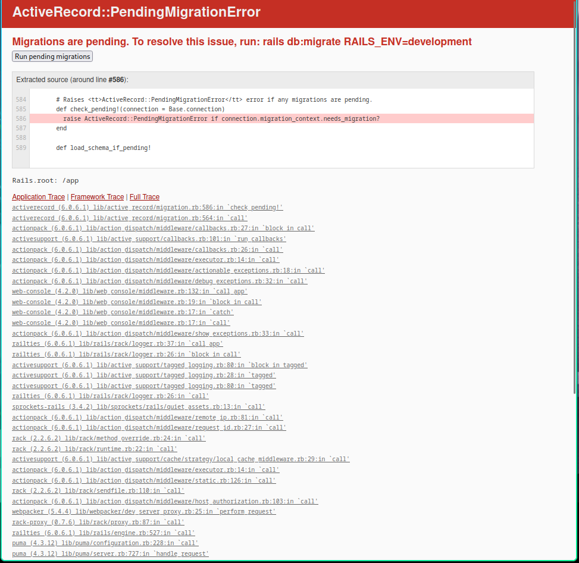
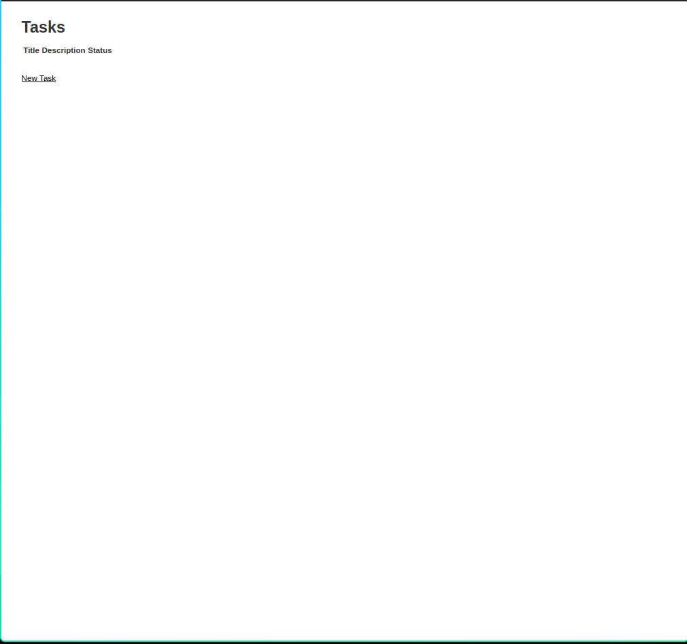

## README
templateからリポジトリを作成し、localに環境をcloneする。
```bash
git clone git@github.com:sakakibara-yuuki/rails-docker.git
```
dockerブランチを作成し、switchする。
```bash
git sw -c docker
```

# Introduction
Dockerを使ってRubyプロジェクトをdocker化する方法を紹介する。
前提としてwebapp(ruby on rails)に関するプロジェクトが既に存在していることを想定する。
Dockerを使ってwebappをdocker化する第一歩は、Dockerfileを作成することである。

今回はrubyのversionは3.0.2を使用し、railsは6.0.3を使用する。
```bash
FROM ruby:3.0.2

RUN apt-get update && apt-get -y install && \
    apt-get install -y build-essential libpq-dev nodejs

WORKDIR /app
COPY Gemfile Gemfile.lock /app/
RUN bundle install
```

今回はホストのプロジェクトディレクトリ全体をコンテナにバインドマウントしている。
ここで一旦`docker build`を実行してみる。
```bash
docker build . -t web
docker run -it --rm -v .:/app -p 3000:3000 web rails s -b 0.0.0.0
```
さて、
```bash
rails s -b 0.0.0.0
```
を実行してみると、以下のエラーが発生する。


```bash
Migrations are pending. To resolve this issue, run: rails db:migrate RAILS_ENV=development
```
DBとの接続がうまくいっていないようだ。(そもそもDBがない)  
DBを作成する前に、これまでのDockerfileでのコマンドをdocker composeに移行する。
```bash
version: '3'

volumes:
  postgres-data:

services:
  web:
    build: .
    ports:
      - "3000:3000"
    volumes:
      - '.:/app'
    environment:
      DATABASE_PASSWORD: 'postgres'
    tty: true
    stdin_open: true
    depends_on:
      - 'db'

  db:
    image: postgres
    environment:
      POSTGRES_USER: 'postgres'
      POSTGRES_PASSWORD: 'postgres'
    volumes:
      - 'postgres-data:/var/lib/postgresql/data'
```
それではdocker composeを実行してみよう。
```bash
 ❯ docker compose up -d         # detach modeで起動
 ❯ docker compose ps            # 起動しているコンテナを確認
NAME                 IMAGE              COMMAND                  SERVICE   CREATED          STATUS         PORTS
rails-docker-db-1    postgres           "docker-entrypoint.s…"   db        10 seconds ago   Up 9 seconds   0.0.0.0:5432->5432/tcp, :::5432->5432/tcp
rails-docker-web-1   rails-docker-web   "irb"                    web       10 seconds ago   Up 9 seconds   0.0.0.0:3000->3000/tcp, :::3000->3000/tcp
```
ちゃんと起動している。
webのbashを起動してみよう。
```bash
 ❯ docker compose exec web bash # bashでコンテナに入る
```
なんかWARNINGがでた。
```bash
WARN[0000] /home/sakakibara/tmp/rails-docker/docker-compose.yml: `version` is obsolete
```
どうやら`docker-compose.yml`の`version`の指定は非推奨(書かなくて良い)らしい。
まぁ、WARNINGは無視して
`config/database.yml`を修正する。
既存の`config/database.yml`は以下のようになっている。

```yml
 ❯ cat database.yml
# SQLite. Versions 3.8.0 and up are supported.
#   gem install sqlite3
#
#   Ensure the SQLite 3 gem is defined in your Gemfile
#   gem 'sqlite3'
#
default: &default
  adapter: sqlite3
  pool: <%= ENV.fetch("RAILS_MAX_THREADS") { 5 } %>
  timeout: 5000

development:
  <<: *default
  database: db/development.sqlite3

# Warning: The database defined as "test" will be erased and
# re-generated from your development database when you run "rake".
# Do not set this db to the same as development or production.
test:
  <<: *default
  database: db/test.sqlite3

production:
  <<: *default
  database: db/production.sqlite3
```
デフォルトがsqlite3になっているので、postgresに変更する。
```yml
# SQLite. Versions 3.8.0 and up are supported.
#   gem install sqlite3
#
#   Ensure the SQLite 3 gem is defined in your Gemfile gem 'sqlite3'
#
default: &default
  adapter: postgresql
  encoding: unicode
  host: db
  username: postgres
  compoile: true
  port: 5432
  password: <%= ENV.fetch("DATABASE_PASSWORD") %>
  pool: <%= ENV.fetch("RAILS_MAX_THREADS") { 5 } %>

development:
  <<: *default
  database: rails-docker_development

# Warning: The database defined as "test" will be erased and
# re-generated from your development database when you run "rake".
# Do not set this db to the same as development or production.
test:
  <<: *default
  database: rails-docker_test

production:
  <<: *default
  database: rails-docker_production
```

さらにさらにGemfileを修正する。
```ruby
source 'https://rubygems.org'
git_source(:github) { |repo| "https://github.com/#{repo}.git" }

ruby '3.0.2'

# Bundle edge Rails instead: gem 'rails', github: 'rails/rails'
gem 'rails', '~> 6.0.3'
# Use sqlite3 as the database for Active Record
# gem 'sqlite3', '~> 1.4'
gem 'pg'
# Use Puma as the app server
gem 'puma', '~> 4.1'
```

それじゃあ、DBを作成してみよう。
```bash
 ❯ docker compose exec web rails db:create
Database 'rails-docker_development' already exists
Database 'rails-docker_test' already exists
 ❯ docker compose exec web rails db:migrate
 ❯ docker compose exec web rails s -b 0.0.0.0
```

やったぜ！

それじゃぁまとめよう。
docker-compose.ymlを以下のように修正する。
```yml
volumes:
  postgres-data:

services:
  web:
    build: .
    ports:
      - "3000:3000"
    volumes:
      - '.:/app'
    environment:
      DATABASE_PASSWORD: 'postgres'
    tty: true
    stdin_open: true
    depends_on:
      - 'db'
    command: /bin/bash -c "rails db:create && rails db:migrate && rails s -b 0.0.0.0"

  db:
    image: postgres
    environment:
      POSTGRES_USER: 'postgres'
      POSTGRES_PASSWORD: 'postgres'
    volumes:
      - 'postgres-data:/var/lib/postgresql/data'
    ports:
      - "5432:5432"
```
これでdocker compose upでpumaが起動できるか...
```bash
/rails-docker docker !6 ❯ docker compose up
[+] Running 15/15
 ✔ db Pulled                                                                        9.9s
   ✔ 2cc3ae149d28 Pull complete                                                     2.0s
   ✔ d1a63825d58e Pull complete                                                     2.5s
   ✔ ed6f372fe58d Pull complete                                                     2.7s
   ✔ 35f975e69306 Pull complete                                                     2.8s
   ✔ 40c4fe86e99d Pull complete                                                     3.1s
   ✔ 4795e1a32ff6 Pull complete                                                     3.2s
   ✔ bcb5a54ae87d Pull complete                                                     3.2s
   ✔ d3983228bec6 Pull complete                                                     3.3s
   ✔ 5378bf7229e9 Pull complete                                                     6.8s
   ✔ bba3241011a6 Pull complete                                                     6.8s
   ✔ 5e1d0413d05a Pull complete                                                     6.9s
   ✔ 6a489170d05e Pull complete                                                     6.9s
   ✔ 440b39aff272 Pull complete                                                     7.0s
   ✔ 582c79113570 Pull complete                                                     7.0s
[+] Building 54.8s (10/10) FINISHED                                       docker:default
 => [web internal] load build definition from Dockerfile                            0.1s
 => => transferring dockerfile: 222B                                                0.0s
 => [web internal] load metadata for docker.io/library/ruby:3.0.2                   1.3s
 => [web internal] load .dockerignore                                               0.0s
 => => transferring context: 2B                                                     0.0s
 => [web 1/5] FROM docker.io/library/ruby:3.0.2@sha256:15dd21ae353c5f4faebed038d9  12.6s
 => => resolve docker.io/library/ruby:3.0.2@sha256:15dd21ae353c5f4faebed038d9d131c  0.0s
 => => sha256:647acf3d48c2780e00cd27bb0984367415f270d78477ef9d5b 54.93MB / 54.93MB  2.2s
 => => sha256:43a012460a2c590e31c635e750a3b2a29d85e6d575d9d3a4822a 7.29kB / 7.29kB  0.0s
 => => sha256:b02967ef003473d9adc6e20868d9d66af85b0871919bcec92419 5.15MB / 5.15MB  0.7s
 => => sha256:e1ad2231829e42e6f095971b5d2dc143d97db2d0870571ba4d 10.87MB / 10.87MB  1.0s
 => => sha256:15dd21ae353c5f4faebed038d9d131c47b9fd84c14be8c3cfbc7 1.86kB / 1.86kB  0.0s
 => => sha256:1ab61bd6653437e017e00493b7fdd8a66e6b1b3904220fb02614 2.00kB / 2.00kB  0.0s
 => => sha256:5576ce26bf1df68da60eeb5162dccde1b69f865d2815aba8b2 54.57MB / 54.57MB  3.8s
 => => sha256:a66b7f31b095b7fa01d8ba10e600a192bab43a1311f50216 196.50MB / 196.50MB  5.8s
 => => extracting sha256:647acf3d48c2780e00cd27bb0984367415f270d78477ef9d5b238e6eb  1.1s
 => => sha256:11c270d8f828fe2d06ecdcab761a226d5de10060af6a34af7e3bed50 200B / 200B  2.4s
 => => sha256:5df92bd6f19a6f98e0a07e6f56f1ca22e5404393ddb728b0a7 28.80MB / 28.80MB  4.0s
 => => extracting sha256:b02967ef003473d9adc6e20868d9d66af85b0871919bcec92419f65c9  0.1s
 => => sha256:834a3e3a7652bcc6309bace7a87e43a4b746f9b50eaeea799fa8a778 176B / 176B  4.2s
 => => extracting sha256:e1ad2231829e42e6f095971b5d2dc143d97db2d0870571ba4d29ecd59  0.1s
 => => extracting sha256:5576ce26bf1df68da60eeb5162dccde1b69f865d2815aba8b2d29e718  1.2s
 => => extracting sha256:a66b7f31b095b7fa01d8ba10e600a192bab43a1311f50216cf6fa9a45  3.5s
 => => extracting sha256:11c270d8f828fe2d06ecdcab761a226d5de10060af6a34af7e3bed501  0.0s
 => => extracting sha256:5df92bd6f19a6f98e0a07e6f56f1ca22e5404393ddb728b0a7d6d1301  0.4s
 => => extracting sha256:834a3e3a7652bcc6309bace7a87e43a4b746f9b50eaeea799fa8a7783  0.0s
 => [web internal] load build context                                               0.1s
 => => transferring context: 7.90kB                                                 0.0s
 => [web 2/5] WORKDIR /app                                                          0.1s
 => [web 3/5] RUN apt-get update && apt-get -y install &&     apt-get install -y b  3.9s
 => [web 4/5] COPY Gemfile Gemfile.lock /app/                                       0.1s
 => [web 5/5] RUN bundle install                                                   35.5s
 => [web] exporting to image                                                        1.2s
 => => exporting layers                                                             1.1s
 => => writing image sha256:b2fdb85097fd2b41139f4baa99422f5da03b704796cfdba6e7bd4b  0.0s
 => => naming to docker.io/library/rails-docker-web                                 0.0s
[+] Running 3/3
 ✔ Network rails-docker_default  Created                                            0.0s
 ✔ Container rails-docker-db-1   Created                                            0.1s
 ✔ Container rails-docker-web-1  Created                                            0.0s
Attaching to db-1, web-1
db-1   |
db-1   | PostgreSQL Database directory appears to contain a database; Skipping initialization
db-1   |
db-1   | 2024-06-29 06:40:16.436 UTC [1] LOG:  starting PostgreSQL 16.3 (Debian 16.3-1.pgdg120+1) on x86_64-pc-linux-gnu, compiled by gcc (Debian 12.2.0-14) 12.2.0, 64-bit
db-1   | 2024-06-29 06:40:16.436 UTC [1] LOG:  listening on IPv4 address "0.0.0.0", port 5432
db-1   | 2024-06-29 06:40:16.436 UTC [1] LOG:  listening on IPv6 address "::", port 5432
db-1   | 2024-06-29 06:40:16.442 UTC [1] LOG:  listening on Unix socket "/var/run/postgresql/.s.PGSQL.5432"
db-1   | 2024-06-29 06:40:16.449 UTC [29] LOG:  database system was shut down at 2024-06-29 06:38:52 UTC
db-1   | 2024-06-29 06:40:16.456 UTC [1] LOG:  database system is ready to accept connections
db-1   | 2024-06-29 06:40:17.626 UTC [33] ERROR:  database "rails-docker_development" already exists
db-1   | 2024-06-29 06:40:17.626 UTC [33] STATEMENT:  CREATE DATABASE "rails-docker_development" ENCODING = 'unicode'
web-1  | Database 'rails-docker_development' already exists
db-1   | 2024-06-29 06:40:17.632 UTC [34] ERROR:  database "rails-docker_test" already exists
db-1   | 2024-06-29 06:40:17.632 UTC [34] STATEMENT:  CREATE DATABASE "rails-docker_test" ENCODING = 'unicode'
web-1  | Database 'rails-docker_test' already exists
web-1  | => Booting Puma
web-1  | => Rails 6.0.6.1 application starting in development
web-1  | => Run `rails server --help` for more startup options
web-1  | Puma starting in single mode...
web-1  | * Version 4.3.12 (ruby 3.0.2-p107), codename: Mysterious Traveller
web-1  | * Min threads: 5, max threads: 5
web-1  | * Environment: development
web-1  | * Listening on tcp://0.0.0.0:3000
web-1  | Use Ctrl-C to stop
web-1  | Started GET "/" for 172.21.0.1 at 2024-06-29 06:40:36 +0000
web-1  | Cannot render console from 172.21.0.1! Allowed networks: 127.0.0.0/127.255.255.255, ::1
web-1  |    (0.2ms)  SELECT "schema_migrations"."version" FROM "schema_migrations" ORDER BY "schema_migrations"."version" ASC
web-1  | Processing by TasksController#index as HTML
web-1  |   Rendering tasks/index.html.erb within layouts/application
web-1  |   Task Load (0.2ms)  SELECT "tasks".* FROM "tasks"
web-1  |   ↳ app/views/tasks/index.html.erb:16
web-1  |   Rendered tasks/index.html.erb within layouts/application (Duration: 2.0ms | Allocations: 2192)
web-1  | [Webpacker] Everything's up-to-date. Nothing to do
web-1  | Completed 200 OK in 19ms (Views: 14.7ms | ActiveRecord: 0.8ms | Allocations: 14333)
web-1  |
web-1  |
```
GOT IT!
そういえばpostgresを12にしなければならなかった...
```yml
volumes:
  postgres-data:

services:
  web:
    build: .
    ports:
      - "3000:3000"
    volumes:
      - '.:/app'
    environment:
      DATABASE_PASSWORD: 'postgres'
    tty: true
    stdin_open: true
    command: /bin/bash -c "sleep 10 && rails db:create && rails db:migrate && rails s -b 0.0.0.0"
    depends_on:
      - 'db'

  db:
    image: 'postgres:12.19-alpine3.20'
    environment:
      POSTGRES_USER: 'postgres'
      POSTGRES_PASSWORD: 'postgres'
    volumes:
      - 'postgres-data:/var/lib/postgresql/data'
```
ここで`command /bin/bash -c "sleep 10"`を追加したのは、dbが立ち上がるまで待つためである。これが無いとdbが立ち上がる前に`rails db:create`が実行されてしまい、エラーが発生する。

なんか途中でwebpackがcompileしてないとかyarnをinstallしろとか言われたのでその修正を行う。
webpackのcompileオプションはrailsでは`true`になっていた。  
そこでyarnのinstallとrailsでwebpackを使ったcompileを行う。  
yarnのinstallは以下
```bash
FROM ruby:3.0.2

WORKDIR /app
RUN apt-get update && apt-get -y install && \
    apt-get install -y build-essential libpq-dev nodejs
RUN curl -sS https://dl.yarnpkg.com/debian/pubkey.gpg | apt-key add - && \
    echo "deb https://dl.yarnpkg.com/debian/ stable main" | tee /etc/apt/sources.list.d/yarn.list && \
    apt update && apt install -y yarn
COPY Gemfile Gemfile.lock /app/
RUN bundle install
```
そして, docker-compose.ymlでcompileの指示を記述する。
```yml
    command: /bin/bash -c "sleep 5 && rails webpacker:install && rails webpacker:compile && rails db:create && rails db:migrate && rails s -b 0.0.0.0"
```
以上！

### sleep 3の問題
`sleep 3`を入れる理由は、dbが立ち上がるまで待つためである。
そこで、`sleep 3`を入れるのではなく、docker composeの[`depends_on`](https://docs.docker.com/compose/compose-file/05-services/#long-syntax-1)と`healthcheck`を使おう。
#### depends_on
```yml
depends_on:
  db:
    condition: service_healthy
```
これは`db`が`service_healthy`になるまで待つという意味である。
conditionには以下の種類がある。
| condition                      | Description                                                                                     |
| ---                            | ---                                                                                             |
| service_started                | 依存サービス(webなど)開始前に、依存関係(dbなど)が開始されたことをトリガーとする。                        |
| service_healthy                | 依存サービス(webなど)開始前に、依存関係(dbなど)が'healthcheck'によってhealthであることをトリガーとする。 |
| service_completed_successfully | 依存サービス(webなど)開始前に、依存関係(dbなど)が正常に完了したことをトリガーとする。                    |

#### healthcheck
`healthcheck`はサービスが正常に動作しているかを確認するための機能である。
Dockerfileにも`HEALTHCHECK`を記述することができる。
docker composeの`healthcheck`もDockerの`HEALTHCHECK`と同じように使うことができる。
ただし、docker composeの`healthcheck`はDockerfileの`HEALTHCHECK`よりも優先(上書き)される。
healthcheckのコマンドと期間指定を記述することができる。
```yml
healthcheck:
    test: ["CMD-SHELL", "pg_isready -U postgres"]
    interval: 1m30x
    timeout: 10s
    start_period: 40s
    start_interval: 5s
    retires: 3
```
`test`はコンテナの状態を確認するためにdocker composeが実行するコマンドを定義する。
文字列かリストで指定することができる。
- リストの場合は`NONE`, `CMD`, `CMD-SHELL`のいずれかを指定する。
- 文字列の場合は`CMD_SHELL`を指定する。
