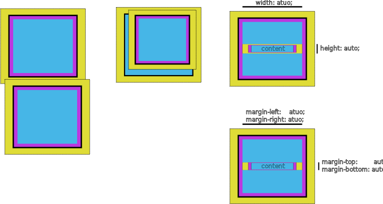

# グリッドレイアウト

ここでは, 最初にグリッドレイアウトについて歴史的な概要や基本的な使い方を説明する.

また, グリッドの処理についても説明する.

作りたいものがある場合は, [テンプレート](#テンプレート)を見てから決めるとよいだろう.

## Contents

## グリッドレイアウトとフレックス

最初のwebブラウザではflow layoutが使われてた.
これはNormal Flowだとか, Text Flowだとか呼ばれるが, 以降ではflow layoutと呼ぶ.
もともとHTMLはきらびやかなデザインで作られたランディングページやチャットやダッシュボードをつくるためのものではなかった. 当初は, 文書を表示するためのものだった. そのため, flow layoutは理に適っていた.

この主張はHTML1.0やHTML2.0の時代には正しく, 推奨されていた.

flow layoutの特徴は要素毎にスタイル付けが可能であり, 要素の相互関係により各要素の配置, すなわち全体のレイアウトが決定されることだ.

スタイルに関して, 当初のブラウザの思想として
"ページをどのように表示するかはブラウザが決めること"
といった思想があったため, ブラウザによってスタイルが異なっていた.
この仕様は現代まで尾を引いていて, ブラウザには初期状態のレイアウトが設定されている.
それをUser Agent Style(UAS)と呼ぶ[^firefox].

そこからCSSが本格的に導入され, レイアウトを組むための仕様が整備された.
どのように要素が配置、相互作用するかはCSS2で規定された. これは[視覚整形モデル](https://developer.mozilla.org/ja/docs/Web/CSS/Visual_formatting_model)(Visual Formatting Model)と呼ばれる.

視覚整形モデルで言及されているいくつかのルールについて紹介する.

<div style="border: dashed black;">

- `block` level element

  - 隣り合う要素の上下marginは重なる(相殺する)
  - 親要素と子孫要素の間にpaddingが無い場合, 上下marginは重なる(相殺する)
  - 要素のcontentが空でpaddingが無い場合, 自信の上下marginは重なる(相殺する)
  - 横幅(`width:`)が`auto`の場合, 親要素の横幅いっぱいになる
  - 高さ(`hegiht:`)が`auto`の場合, contentの高さになる
  - 左右marginが`auto`で, 親要素内に余剰スペースがある場合, 中央に配置される
  - 上下marginが`auto`の場合, 0になる

- `inline` level element

  - displayが`inline`の場合, 横幅と高さの指定は適用されない.
  - displayが`inline-block`の場合, 横幅と高さの指定は適用されない.
  - 隣接する要素の間には左右margin, border, paddingが適用される.
  - 左右marginが`auto`の場合, 0になる.
  - 上下marginは重ならない(相殺しない).
  - 1行の高さはテキストや各要素のline-heightやheightによって決まる.
  - displayが`inline`の場合, 上下margin, border, paddingが1行の高さに影響される.

- float element

  - flowに従って, 垂直方向の配置が行われる.
  - 水平方向は親の左右に揃えた配置になる.
  - flow外の要素として扱われるが, 後続のtextやinline要素は回り込む.

- position element
  - flow外の要素として扱われ, 通常flowから独立して扱われる.
  - positionが`static`以外の, 直近のコンテナブロックが位置指定の基準(包含ブロック)となる.
  - 横幅や高さが`auto`の場合, contentのサイズになる.

</div>

などである.  
中には直感とは異なると感じるルールもあるかもしれない.  
display, 隣接関係(つまり上下関係), 親子関係, 親孫関係それぞれのパターンでmargin, padding, borderに異なる影響を及ぼす.
しかし, これらルールを覚えて, 理解してレイアウトを組まなければならない.

特にヤバいのが,

- block要素と隣接するblock要素のmaringが重なること.
- block要素と子の関係にあるblock要素のmarginが重なること.
- block要素と子の関係にあるinline要素の`auto`marginの挙動が変わること.



である.  
これに加えて各要素独自の挙動も把握しなければならない.

"要素の相互作用を考慮したレイアウト"  
✕  
"各要素独自の挙動"  
で完全に殺される.  
そう,  
**普通の人間にCSSでレイアウトを組むのは難しい.**

いわゆる現代のwebサービスは, UIコンポーネント, CMSからのコンテンツ, 動的コンテンツなどで構成されている.
このように外部のコンテンツが将来どのように変化し, どのように配置されるかを考慮しなければならない場合, 要素の相互作用を考慮したレイアウトを組むことは事実上, 不可能である.

根本的な原因はHTML, CSSがドキュメントのレイアウトをターゲットにしていることである.

このような問題を解決するために, HackやFlexboxなどが登場した.
HackはCSSの仕様を力技で組み合わせてレイアウトを組むテクニック集である.  
時には, ブラウザのバグや内部処理を利用する古の黒魔術でもある.
フクロウセレクタ`* + *`もこの一つである.

FlexboxはCSS3で導入されたレイアウトモデルである.
次に, Flexboxについて説明する.

<!-- ``` mermaid -->
<!-- timeline -->
<!--     title CSS関連の歴史 -->
<!--     1989 : World Wide Web -->
<!--     1990 : 最初のブラウザ -->
<!--     1996 : CSS1 -->
<!--     1998 : CSS2 -->
<!--     2004 : Reset CSS -->
<!--     2006 : CSSフレームワーク -->
<!--     2009 : FlexBox(草案) -->
<!--     2011 : BootStrap -->
<!--          : CSS Grid(草案 by microsoft) -->
<!--     2012 : BootStrap2 -->
<!--          : FlexBox(勧告) -->
<!--     2014 : フクロウセレクタ -->
<!--     2016 : CSS Grid(勧告) -->
<!--     2017 : Tailwind CSS -->
<!--          : IE以外のブラウザがCSS Gridに対応 -->
<!--     2019 : Every Layout -->
<!--     2023 : Panda CSS -->
<!-- ``` -->


- [The birth of the web](https://home.cern/science/computing/birth-web)
- [The birth of the World Wide Web](https://timeline.web.cern.ch/taxonomy/term/90)

### Flexbox

flex boxはfloatを使ったハック

[^firefox]: [FireFoxのUAS](https://searchfox.org/mozilla-central/source/layout/style/res/html.css)

## 基本のグリッド

グリッドのレイアウトの基本は3つある.

- ライン
- トラック
- テンプレート

### ライン

**ライン**はグリッドラインをベースにラインに沿って要素を配置する方法である.
伝統的なグラフィックデザインやエディトリアルデザイン(紙面上のデザイン)のレイアウトから採用されている. デザイナーに優しい.

<div style="display: grid; grid-template-columns: 1fr 2fr; gap: 1em; align-items: center;">

<div style="display: grid; grid-template-columns: 20% 20% auto 100px; grid-template-cows: 360px 180px; gap: 10px; border: 1px solid black; border-radius: 3px;">
<div style="grid-column: 1 / 2; grid-row: 1 / 2; background: #e9e9e9;">A</div>
<div style="grid-column: 2 / 4; grid-row: 1 / 2; background: #828282;">B</div>
<div style="grid-column: 4 / 5; grid-row: 1 / 3; background: #a494b4">C</div>
<div style="grid-column: 1 / 3; background: #a494b4">D</div>
<div style="background: #a494b4">E</div>
</div>

```css
.grid {
  display: grid;
  grid-template-columns: 20% 20% auto 200px;
  grid-template-rows: 360px 180px;
  gap: 10px;
}

.item1 {
  grid-column: 1 / 2;
  grid-row: 1 / 2;
}

.item2 {
  grid-column: 2 / 4;
  grid-row: 1 / 2;
}

.item3 {
  grid-column: 2 / 4;
  grid-row: 1 / 2;
}
...
```

</div>

### トラック

**トラック**はスペースを縦方向に分割したトラックをベースに要素を配置する方法である.
"カラムグリッド"とも呼ばれ, 12分割されたものなどは12カラムグリッドと呼ばれる.
モバイルでは4カラムグリッドを採用することが多く, webでは古くから親しまれていた.

<div style="display: grid; grid-template-columns: 1fr 2fr; gap: 1em; align-items: center;">

<div style="display: grid; grid-template-columns: repeat(12, 1fr); grid-template-cows: 360px 180px; gap: 10px; border: 1px solid black; border-radius: 3px;">
<div style="grid-column: span 3; background: #e9e9e9;">A</div>
<div style="grid-column: span 6; background: #828282;">B</div>
<div style="grid-column: span 3; grid-row: span 2; background: #a494b4">C</div>
<div style="grid-column: span 6; background: #a494b4">D</div>
<div style="grid-column: span 3; background: #a494b4">E</div>
</div>

```css
.grid {
  display: grid;
  grid-template-columns: repeat(12, 1fr);
  grid-template-rows: 360px 180px;
  gap: 10px;
}

.item1 {
  grid-column: span 3;
}

.item2 {
  grid-column: span 6;
}

.item2 {
  grid-column: span 3;
  grid-row: span 2;
}
...
```

</div>

### テンプレート

**テンプレート**はグリッドでエリアを定義し, 各エリアに要素を配置する方法である.
Bert Bosが提案した"Template Layout"という仕様が元とっている.
一番直感的でわかりやすい.

<div style="display: grid; grid-template-columns: 1fr 2fr; gap: 1em; align-items: center;">

<div style='display: grid; grid-template-columns: 20% 20% auto 100px; grid-template-cows: 360px 180px; grid-template-areas: "text main main side" "sub1 sub1 sub2 side"; gap: 10px; border: 1px solid black; border-radius: 3px;'>
<div style="grid-area: text; background: #e9e9e9;">A</div>
<div style="grid-area: main; background: #828282;">B</div>
<div style="grid-area: side; background: #a494b4">C</div>
<div style="grid-area: sub1; background: #a494b4">D</div>
<div style="grid-area: sub2; background: #a494b4">E</div>
</div>

```css
.grid {
  display: grid;
  grid-template-columns: 20% 20% auto 200px;
  grid-template-rows: 360px 180px;
  grid-template-areas:
    "text main main side"
    "sub1 sub1 sub2 side";
  gap: 10px;
}

.item1 {
  grid-area: text;
}

.item2 {
  grid-area: main;
}
...
```

</div>

## CSS Gridの処理
### 自動配置
css gridには自動配置機能がある.
グリッドアイテムには次の3つのステップがある.
1. (行, 列)が指定されたアイテムが配置される.
1. (行,)が指定されたアイテムが配置される.
1. (,列)が指定もしくは無指定のアイテムが配置される.


#### 自動配置の例
以下では自動配置の例を示す.

```css
.grid {
  display: grid;
  grid-template-columns: 20% 20% auto 200px;
  grid-template-rows: 360px 180px;
  gap: 10px;
}
/* span は無指定 */
.item2 {
  grid-column: span 2;
}
/* span は無指定 */
.item3 {
  grid-column: span 2;
}
```

<div style="display: grid;
            gap: 3px;
            background-color: gray;
            grid-template-columns: repeat(4, 1fr);
            grid-template-rows: repeat(2, 1fr);
            text-align: center;
            ">
<div style="                     background-color: #a494b4;">item1 (1)</div>
<div style="grid-column: span 2; background-color: #a494b4;">item2 (2)</div>
<div style="grid-column: span 2; background-color: #a494b4;">item3 (3)</div>
<div style="background-color: #a494b4;">item4 (4)</div>
<div style="background-color: #a494b4;">item5 (5)</div>
</div>

注意点だが、`span`は自動配置として扱われる.  
ここで, (n)は配置順を示す.

#### 一部を指定配置にする
以下ではitem2, item3を(行, 列), (行,)指定配置した場合の例を示す.

```css
.grid {
  display: grid;
  grid-template-columns: 20% 20% auto 200px;
  grid-template-rows: 360px 180px;
  gap: 10px;
}
/* 行, 列の指定 */
.item2 {
  grid-column: 3 / 5;
  grid-row: 1 / 3;
}
/* 行, の指定 */
.item3 {
  grid-row: 2;
}
```

<div style="display: grid;
            gap: 3px;
            background-color: gray;
            grid-template-columns: repeat(4, 1fr);
            grid-template-rows: repeat(2, 1fr);
            text-align: center;
            ">
<div style="                     background-color: #a494b4;">item1 (3)</div>
<div style="grid-column: 3 / 5; grid-row: 1 / 3; background-color: #a494b4;">item2 (1)</div>
<div style="grid-row: 2; background-color: #a494b4;">item3 (2)</div>
<div style="background-color: #a494b4;">item4 (4)</div>
<div style="background-color: #a494b4;">item5 (5)</div>
</div>

なお, ここで
```css
/* (,列) を指定, (行, )は無指定 */
.item2 {
  grid-column: 3 / 5;
  grid-row: span 2;
}
/* (行,) を指定 */
.item3 {
  grid-row: 2;
}
```
とすることで,
<div style="display: grid;
            gap: 3px;
            background-color: gray;
            grid-template-columns: repeat(4, 1fr);
            grid-template-rows: repeat(2, 1fr);
            text-align: center;
            ">
<div style="                     background-color: #a494b4;">item1 (2)</div>
<div style="grid-column: 3 / 5; grid-row: span 2; background-color: #a494b4;">item2 (3)</div>
<div style="grid-row: 2; background-color: #a494b4;">item3 (1)</div>
<div style="background-color: #a494b4;">item4 (4)</div>
<div style="background-color: #a494b4;">item5 (5)</div>
</div>
となる.

ここでは, item3は行を指定されているため、はじめに配置される.
item2は行が指定されていないため, 無指定として配置される.

#### 配置を全部埋める
さきほどでは, 空いているスペースがあった。これを埋めるには`dense`を使う.

```css
.grid {
  display: grid;
  grid-template-columns: 20% 20% auto 200px;
  grid-template-rows: 360px 180px;
  grid-auto-flow: dense;
  gap: 10px;
}
/* 上の例と同じ */
...
```
<div style="display: grid;
            gap: 3px;
            background-color: gray;
            grid-template-columns: repeat(4, 1fr);
            grid-template-rows: repeat(2, 1fr);
            grid-auto-flow: dense;
            text-align: center;
            ">
<div style="                     background-color: #a494b4;">item1 (2)</div>
<div style="grid-column: 3 / 5; grid-row: span 2; background-color: #a494b4;">item2 (3)</div>
<div style="grid-row: 2; background-color: #a494b4;">item3 (1)</div>
<div style="background-color: #a494b4;">item4 (4)</div>
<div style="background-color: #a494b4;">item5 (5)</div>
</div>

普通は右から左へ, 上から下へ埋まっていく.  
`grid-auto-flow: row`と指定すると, 右から左へ, 上から下へ埋まっていく.  
`grid-auto-flow: column`と指定すると, 上から下へ, 右から左へ埋まっていく.  
デフォルトでは`grid-auto-flow: row`である.


#### 配置を被せる
(行, 列)が指定されると, 空いているかどうかに関わらず配置される.

```css
.grid {
  display: grid;
  grid-template-columns: 20% 20% auto 200px;
  grid-template-rows: 360px 180px;
  grid-auto-flow: dense;
  gap: 10px;
}

/* (行, 列)を指定 */
.item1 {
  grid-column: 1 / -1;
  grid-row: 1;
  z-index: 1;
  opacity: 0.8;
}

/* (行, 列)を指定 */
/* self-justify を指定 */
.item2 {
  grid-column: 1 / -1;
  grid-row: 1;
  self-justify: center;
}
```
<div style="display: grid;
            gap: 3px;
            background-color: gray;
            grid-template-columns: repeat(4, 1fr);
            grid-template-rows: repeat(2, 1fr);
            grid-auto-flow: dense;
            text-align: center;
            ">
<div style="grid-column: 1 / -1;
            grid-row: 1;
            z-index: 1;
            opacity: 0.8;
            background-color: #a494b4;
            text-align: left;">item1 (2)</div>
<div style="grid-column: 1 / -1; grid-row: 1; background-color: red; justify-self: center;">item2 (3)</div>
<div style="grid-row: 2; background-color: #a494b4;">item3 (1)</div>
<div style="background-color: #a494b4;">item4 (4)</div>
<div style="background-color: #a494b4;">item5 (5)</div>
</div>

この例では, item1, item2が被せられている.　　
`z-index: 1`が指定されているため, item1が上に配置される.  
item2はitem1の下に配置される.  

また、配置先での配置を指定するには`justify-self`, `align-self`を使う.
item2は`justify-self: center`が指定されているため, 横方向の中央に配置される.


## justify-content, self, items
#### justify-content
フレックスコンテナなら主軸、グリッドならインライン軸に沿って内容(content)を調整する。

主軸は`flex-direction`で指定されている方向、
インライン軸はインライン要素が積まれる方向、日本語や英語なら左から右。
ブロック軸はブロック要素が積まれる方向、日本語や英語なら上から下である。

日本語、英語の場合、左から右への軸でcontentを刺し、その方向でcontent同士を調整するというイメージである。

#### justify-self
各content内の単一のitemに対して指定される。

フレックスボックスレイアウトなら無視される。
グリッドレイアウトならインライン軸(左から右)

日本語、英語の場合、左から右への軸でcontentを刺し、その方向でcontent内でのitemの位置を調整するというイメージである。

#### justify-items
一斉にjustify-selfをする。


## align-content, self, items
#### align-content
フレックスボックスの交差軸、グリッドならブロック軸に沿って内容(content)を整列する。

日本語、英語の場合、上から下への軸でcontentを刺し、その方向でcontent同士を整列するというイメージである。

#### align-self
各content内の単一のitemに対して指定される。

フレックスボックスの交差軸のmarginが`margin: auto`なら無視される。
グリッドレイアウトならインライン軸(左から右)

日本語、英語の場合、上から下への軸でcontentを刺し、その方向でcontent内でのitemの位置を整列するというイメージである。

#### align-items
一斉にalign-selfをする。

## justiry-content, align-content

justiry-content, align-content, justiry-items, align-items はコンテナとしての役割を持つタグに対して適用するべきプロパティである。

## テンプレート

webサイトやwebサービスにはいくつかのテンプレートがある.

### 聖杯レイアウト

<div style="display: grid; grid-template-columns: 1fr 1fr;">


<div style="display: flex; justify-content: center;">
<div style="display: grid;
            grid-template-columns: repeat(5, 1fr);
            grid-template-rows: repeat(6, 1fr);
            width: 70%;
            border: 1px solid black;">
<div style="grid-column: 1 / -1;">
  <div style="text-align: center; background: #e8e8e8;">
    Head
  </div>
</div>
<div style="grid-row: 2 / -2; grid-column: 1">
  <div style="text-align: center; height: 100%; background: #a8a8a8; ">
    B
  </div>
</div>
<div style="grid-row: 2 / -2; grid-column: 2 / -2;">
  <div style="text-align: center;">
    C
  </div>
</div>
<div style="grid-row: 2 / -2 ; grid-column: -2;">
  <div style="text-align: center; height: 100%; background: #a8a8a8;">
    D
  </div>
</div>
<div style="grid-row: -2 / -1; grid-column: 1 / -1; ">
  <div style="text-align: center; background: #e8e8e8;">
    Footer
  </div>
</div>
</div>
</div>

</div>

中央にメインコンテンツを配置し, 超サイドにはサイドバーを配置するレイアウト.

### ダッシュボードUI

<div style="display: grid; grid-template-columns: 1fr 1fr; grid-template-rows: repeat(8, auto);">


<div style="display: flex; justify-content: center; grid-column: 2; grid-row: span 3;">
  <div style="display: grid;
              grid-template-columns: repeat(5, 1fr);
              grid-template-rows: repeat(6, 1fr);
              width: 70%;
              border: 1px solid black;">
    <div style="grid-column: 1 / -1;">
      <div style="text-align: center; height: 100%; background: #e8e8e8;">
        Head
      </div>
    </div>
    <div style="grid-row: 2 / -1; grid-column: 1;">
      <div style="text-align: center; height: 100%; background: #a8a8a8; ">
        B
      </div>
    </div>
    <div style="grid-row: 2 / -1; grid-column: 2 / -2;">
      <div style="text-align: center;">
        C
      </div>
    </div>
  </div>
</div>

<div style="grid-column: 2; grid-row: span 1;">
ヘッダーを省略できる場合.
</div>

<div style="display: flex; justify-content: center; grid-column: 2;">
  <div style="display: grid;
              grid-template-columns: repeat(5, 1fr);
              grid-template-rows: repeat(6, 1fr);
              width: 70%;
              border: 1px solid black;">
    <div style="grid-column: 2 / -1;">
      <div style="text-align: center; background: #e8e8e8;">
        Head
      </div>
    </div>
    <div style="grid-row: 1 / -1; grid-column: 1">
      <div style="text-align: center; height: 100%; background: #a8a8a8; ">
        B
      </div>
    </div>
    <div style="grid-row: 2 / -1; grid-column: 2 / -2;">
      <div style="text-align: center;">
        C
      </div>
    </div>
  </div>
</div>

</div>

ヘッダー, サイドバー, メイン部分で構成されるダッシュボードUI.
基本的にはサイドバーは開閉可能なようにする.

### チャットUI

<div style="display: grid; grid-template-columns: 1fr 1fr; grid-template-rows: repeat(8, auto);">


<div style="display: flex; justify-content: center;">
<div style="display: grid;
            grid-template-columns: repeat(5, 1fr);
            grid-template-rows: repeat(6, 1fr);
            width: 70%;
            border: 1px solid black;">
<div style="grid-row: 1 / -2; grid-column: 1 / -1;">
  <div style="text-align: center;">
    history
  </div>
</div>
<div style="grid-row: -1; grid-column: 1 / -1;">
  <div style="text-align: center; background: #e8e8e8;">
    input
  </div>
</div>
</div>
</div>

</div>

メインとフッターで構成されるUI.
ダッシュボードUIなどと組み合わせることが多い.

### フルブリード・レイアウト

このブログがフルブリード・レイアウトになっている.

<div style="display: flex; justify-content: center;">
<div style="display: grid;
            grid-template-columns: repeat(5, 1fr);
            grid-template-rows: repeat(6, 1rem);
            width: 70%;
            border: 1px solid black;">
<div style="grid-row: 1 / -1; grid-column: 1;">
  <div style="text-align: center; height: 100%; background: #e8e8e8;">
    margin
  </div>
</div>
<div style="grid-row: 1 / -1; grid-column: 2 / -2;">
  <div style="text-align: center; height: 100%; ">
    Content
  </div>
</div>
<div style="grid-row: 1 / -1; grid-column: -2;">
  <div style="text-align: center; height: 100%; background: #e8e8e8;">
    margin
  </div>
</div>
</div>
</div>

- [記事は中央に固定幅](https://coliss.com/articles/build-websites/operation/css/full-bleed-layout-using-css-grid.html)
- [Full-Bleed Layout Using CSS Grid](https://www.joshwcomeau.com/css/full-bleed/)

以前このタイプのレイアウトを作成したことがある.  
フルブリード・レイアウトについて知っていればよかった...

縦のラインで全幅やコンテンツの幅を調整する.
サブグリッドを使うことで一貫したレイアウトを実現する.

フルブリードとはいわゆる"フチ無し印刷"のことを指す.
フルブリードで印刷すると, 用紙の端から端まで印刷される.

### パンケーキ・スタック・レイアウト

<div style="display: grid; grid-template-columns: 1fr 1fr; grid-template-rows: repeat(8, auto);">


  <div style="display: flex; justify-content: center;">
    <div style="display: grid;
                grid-template-rows: repeat(6, 1fr);
                width: 70%;
                border: 1px solid black;">
      <div style="grid-row: 1 / 2;">
        <div style="text-align: center; height: 100%; background: #e8e8e8;">
          Header
        </div>
      </div>
      <div style="grid-row: 2 / 5;">
        <div style="text-align: center; height: 100%; ">
          Content
        </div>
      </div>
      <div style="grid-row: 6 / 7;">
        <div style="text-align: center; height: 100%; background: #e8e8e8;">
          Footer
        </div>
      </div>
    </div>
  </div>
</div>

- [パンケーキ・スタック・レイアウト](https://coliss.com/articles/build-websites/operation/css/css-grid-with-5-layouts.html)

伝統的なwebサイトのレイアウト.
ヘッダー, フッター, メインコンテンツで構成される.

フッターの下には余白が入らないことが多い.
また, フッターは画面に固定することも画面外に配置することもある.

### 聖杯レイアウト

聖杯レイアウトはヘッダー, フッター, メインコンテンツで構成される.
